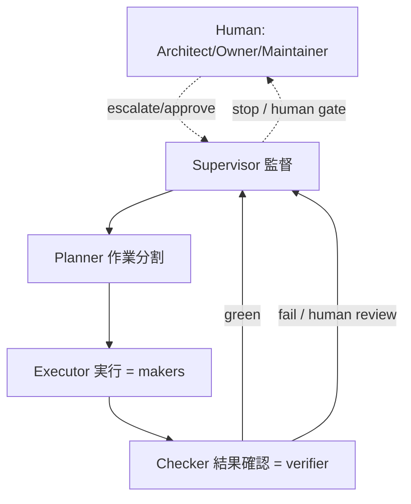

# .github/agents/ — 層2: Custom Agents

`<name>.agent.md`（VS Code custom agent 形式）を置く。書式は **awesome-copilot 準拠**:
frontmatter は **`name`**（`title` ではない）/ `description`（`USE FOR:` ・ `DO NOT USE FOR:` 入り）/ `tools`（**配列・末尾カンマ禁止・公式の名前空間名**）/ 任意 `model`。本文は薄く保ち、手順は層3 Skill に委ねる（ADR-0012）。

> **設計**（ADR-0016）: **maker / checker を分離**し、**最小権限**で配る。**source of truth（`legacy/` と `tests/<prog>/golden/`）はどのエージェントも触らない**。GitHub への副作用（Issue / PR 発行）は層4 gh-aw に寄せる。

ループ順（1周 = COBOL 1本）と役割分担:

| Agent | 役割 | 区分 | tools |
|---|---|---|---|
| `supervisor.agent.md` | planner→executor→checker を監督し continue/retry/escalate/stop を判断（人間確認ゲート所有） | 監督 | `read, search, todo` |
| `planner.agent.md` | 1 program を worker サイズの順序付き bounded タスクに分割（done/stop 条件付き） | 計画 | `read, search, todo` |
| `triage.agent.md` | `manifest.yaml` から次の 1 本を選び Issue 草案 | 心拍（macro plan） | `read, search, todo` |
| `discovery.agent.md` | 依存/ホットスポットを抽出し `manifest.yaml` と可視化グラフを更新 | 事前調査 | `read, search, edit, execute, todo` |
| `system-analyzer.agent.md` | 複数サブシステムを俯瞰し `specs/system-overview.md`・`specs/subsystems/*` と `manifest.yaml subsystems:` を整える | 全体分析 | `read, search, edit, todo` |
| `containerizer.agent.md` | COBOL サブシステムを共有 image と ACA Jobs/Service に rehost コンテナ化 | 移行(コンテナ) | `read, search, edit, execute, todo` |
| `deployer.agent.md` | Bicep+azd で Azure を provisioning、Azure MCP で確認運用 | 移行(Azure) | `read, search, edit, execute, todo` |
| `cobol-analyzer.agent.md` | I/O 仕様・実行方法・データ定義を解析（read-only） | 解析 | `read, search` |
| `spec-extractor.agent.md` | **Code→Doc**: COBOL の業務仕様を `specs/<prog>.md` に機械抽出（tree-sitter/`tools/spec-extract`）して構造化 | maker-1 | `read, search, edit, todo` |
| `migrator.agent.md` | **Doc→Code**: spec から Java 生成、不可なら wrapper | maker-2 | `read, search, edit, execute, todo` |
| `verifier.agent.md` | candidate == golden ＋ intent 妥当性 ＋ ADR(Proposed) | checker | `read, search, edit, execute, todo` |

> `tools` はパス制限まではできないため、「migrator は golden を触らない / verifier はコードを触らない」は各 `.agent.md` 本文の**ガードレール**で縛る。

> **長時間処理の止まり方**（ADR-0022）: `gh-aw` / CI / GitHub Actions のような 2分以上の処理は、安価モデルに**自律リトライ・無断キャンセルさせない**。停止・確認・再試行は skill [`long-running-ops`](../skills/long-running-ops/SKILL.md) に従う。

## オーケストレーション層（ADR-0023）

bounded worker（ADR-0022）が成立するには、**分割役（planner）と監督役（supervisor）**が要る。4役で分ける（executor / checker は既存の maker / verifier にマップ）。

- **Supervisor**: 各ステップ後に continue / retry-with-change / escalate / stop を判断。**auto-retry しない**。10分級は人間確認（ADR-0022）。
- **Planner**: bounded unit を worker タスク列へ分割（done/stop 条件付き）。
- **Executor**: `cobol-analyzer` / `spec-extractor` / `migrator`（Skill 制約下なら worker tier 可）。
- **Checker**: `verifier`（standard/frontier）。
- モデル tier は役で変える（ADR-0021）: 判断役（supervisor/planner/checker）= standard/frontier、実行役（executor）= worker。
- 小ジョブには過剰。最小経路 `triage → maker → verifier` を選んでよい。

## Human Roles / Accountability Boundary

AI Agents は実行補助者であり、最終責任を持つ主体ではない。
本ループでは、AI に作業を丸投げするのではなく、AI が抽出した仕様・差分・リスクを、人間が責任を持って判断できる形にする。

- **Architect / Owner**
  - 移行対象、優先順位、受け入れ条件を決める
  - Rewrite / Wrapper / 保留などの移行方針を判断する
  - ループ全体の責任境界を定義する

- **COBOL Reviewer**
  - AI が抽出した仕様仮説を、COBOL の意味論と業務意図の観点で確認する
  - `REDEFINES`、`OCCURS`、`PIC`、暗黙小数点、丸め、編集表示、文字コード、DB アクセス、ファイル I/O などの危険箇所を確認する
  - 未確認仕様を Assumption / Risk / TODO として分類する

- **Maintainer**
  - PR の最終承認を行う
  - ADR を Proposed から Accepted に変更する
  - CI / Golden Master / Spec / Human Review の結果を踏まえて、リリース可否を判断する

AI は高速に仕様仮説・実装候補・検証結果を生成できるが、責任は取れない。
したがって、人間の役割は全量を読むことではなく、AI が提示した evidence と risk hotspot をもとに、責任ある判断点を承認することである。
