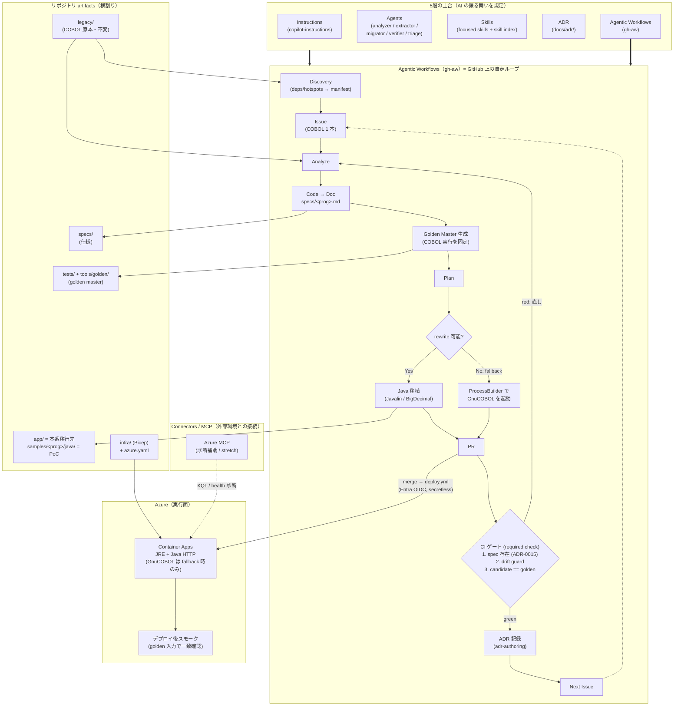

# 全体アーキテクチャ

OpenCOBOL → モダン（Java）移行を **GitHub 上の AI 自走ループ**で回し、**golden master 等価性**をゲートに、最終成果物を **Azure Container Apps** で稼働させる。AI の振る舞いは **5層フレームワーク**（Instructions / Agents / Skills / ADR / Agentic Workflows）で規定し、**MCP** は Azure など外部環境と接続するための拡張レイヤーとして扱う。



## 今回の成功条件

今回の成功条件は、COBOL を大量に変換することではない。

対象プログラム１本について、以下を GitHub 上で一周させることを成功条件とする。

```text
Issue
  ↓
Analyze
  ↓
Code → Doc
  ↓
Golden Master
  ↓
Plan
  ↓
Rewrite or Wrapper
  ↓
PR
  ↓
CI
  ↓
ADR
  ↓
Next Issue
```

つまり、AI 時代のモダナイゼーションを「一度きりの変換」ではなく、継続的に改善できる開発ループとして示す。

## 読み方（凡例）

- **土台（5層）**: Instructions / Agents / Skills / ADR / Agentic Workflows が AI の振る舞いと判断の流れを規定する。
- **MCP / Connectors**: Azure MCP は5層そのものではなく、Azure など外部環境と接続するための拡張レイヤー。今回の必須経路ではなく、主に診断補助として扱う。
- **Code→Doc（`tools/spec-extract`）**: `extract.sh` が tree-sitter-cobol grammar（COBOL85・gzip 凍結 vendoring）で COBOL を parse し、`queries/spec.scm` クエリでデータ項目・処理フロー・組込関数を抽出して Markdown に整形する（ADR-0019）。**振る舞いの正は cobc golden（ADR-0005）**のまま。本ツールは spec の裏付け・網羅性チェックの補助であり、CI には組み込まない。
- **Discovery（v0 は hotspot-driven）**: `tools/deps` が `manifest.yaml` に `calls/copybooks/sql/files/hotspots/migratable` を埋め、`triage.md` はこの台帳を使って次の対象を選ぶ（ADR-0020）。
- **Skills（focused + index）**: 例 = `cobol-to-spec` / `spec-to-java` / `cobol-java-wrapper` / `golden-master-testing` / `adr-authoring`。増えても `.github/skills/README.md`（skill index）で発見性を担保（ADR-0012）。
- **ループの心臓 = CI の 3 ゲート**: ① spec 存在（ADR-0015）② drift guard（committed golden == 再 freeze）③ `candidate vs golden` 等価（required check `golden-master equivalence`）。すべて green で前進、赤なら Analyze に戻る（停止条件 = 等価性）。
- **移行方式（ADR-0004 Strategy B）**: `rewrite`（Java）を優先し、不可なら `ProcessBuilder` で GnuCOBOL を包む `fallback`（rehost）。どちらも同じ golden で検証。
- **検証の権威は local/CI**: Azure は最終デプロイ＋薄いスモークのみ。`PR merge → deploy.yml`（Entra OIDC, secretless）で自動 deploy。
- **artifacts は横割り**: `legacy/`（不変の原本）→ `specs/`（Code→Doc）→ `app/`（Doc→Code・本番／サンプルは `samples/<prog>/java/`）→ `tests/`・`tools/golden/`（等価性）／`infra/`（Bicep）。
- **現状（2026-06-27）**: golden ハーネス＋CI 3ゲートは**実装済み**（`samples/interest` で green）。**gh-aw（triage/migrate/verify）と Azure deploy（`deploy.yml`）は計画中（未作成）**。

> 関連 ADR: 0004（移行方式）/ 0005（golden master）/ 0006（5層＝自走ループ）/ 0007（Azure Container Apps）/ 0008（Java＋ProcessBuilder）/ 0009（Code→Doc→Code）/ 0010（gh-aw 必達）/ 0011（リポジトリ構成）/ 0012（focused skills＋index）/ 0013（本番 Java のみ）/ 0014（2層 Scorecard）/ 0015（Code→Doc spec ゲート）。
