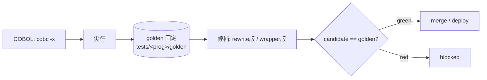

# COBOL モダナイゼーション × Loop Engineering — 実行プラン

> **Status**: 計画確定・実装着手前のドラフト / **最終更新**: 2026-06-26
> **目的**: 社内ハッカソン（2026-06-30）に向けた実行計画。GitHub Copilot を使い、当日支給される
> レガシー COBOL を **AI の自走ループ**で Java へ「検証付き移行」し、Azure にデプロイするまでを設計する。
> **位置づけ**: ハッカソンは**順位なし**＝「何をどうやったか」を発表して技術力を示す場。
> よって**フレームワークと物語（と再現可能な仕組み）が主役**。

---

## 1. TL;DR
- レガシー COBOL を、**直訳（Code→Code）ではなく `Code→Doc→Code`**（業務仕様を Doc に救い出してから Java を生成）で移行する。
- 各プログラムは **rewrite（Java）優先 → 時間内に通らなければ rehost（COBOL をそのまま包む）にフォールバック**。1パスで処理。
- 正しさは **golden master（＝COBOL を実行した出力を固定したもの）** で必ずゲートする（ローカル/CI が権威）。
- デプロイ先は **Azure Container Apps**（IaC: Bicep+azd、認証: Entra OIDC でシークレットレス）。
- 仕組みは前回の **5層フレームワーク（Instructions / Agent / Skill / Agentic Workflow / ADR）× MCP** を、
  **Loop Engineering（心拍・maker/checker 分離・振る舞い等価性検証）** として自走ループ化する。
- **今回の主役は「Loop を回す」こと**。`gh-aw`（triage/migrate/verify）でループを定義し、**手動 dispatch でも 1本の COBOL を
  `Issue → … → PR → CI → ADR → Next Issue` まで GitHub 上で1周**させるのが must-have。完全自動化（schedule 等）は stretch。
- 当日は実質 ~5h（7h − 準備 ~2h）。事前4日で**再利用ハーネス**と**発表ストーリー**を作り、サンプルで1周実証しておく。

---

## 2. 前提・制約
| 項目 | 内容 |
|---|---|
| 当日時間 | 7h、うち準備で ~2h → **実質 ~5h** |
| COBOL ソース | **当日支給**（batch/ファイルI/O か interactive か未確定）→ 事前は汎用ハーネス＋自作サンプルで実証 |
| 移行先 | **Java**（前回資産・enterprise 受け・BigDecimal が COMP-3 に好相性）。API host = 軽量 Java（Javalin/Spark） |
| デプロイ | **Azure Container Apps**。Connector に **Azure MCP** を使いたい |
| Copilot | 有料プラン + private/internal リポジトリ → automations / cloud agent / gh-aw がフルに使える |
| チーム | 4 名 |
| 評価 | 順位なし。発表して技術力を示す |
| 前回実績 | 5層フレームワーク × 各エージェント MCP で「古い Java → 最新 Java」を移行 |

### 既存の土台（このリポジトリに既にあるもの）
- `docs/loop-engineering.md` — Loop Engineering の概念整理 ＋ GitHub 版マッピング
- `docs/adr/`（README / template / 0001–0016, 全 Accepted）— ADR 運用と判断16件
- 注意: Phase 0（scaffold・初期コミット・branch protection）は完了済み

---

## 3. 戦略の核（Strategy B: rewrite 優先 → rehost フォールバック）

### 3.1 なぜ Code→Doc→Code（直訳しない）
- **Code→Code 直訳は "JOBOL"**（COBOL そっくりの Java）を生み、**業務が分からないまま＝保守不能**（comprehension / intent debt が残る）。
- 間に **Doc（業務仕様）** を挟むと、**業務理解が living documentation として残り**、生成される Java も保守可能になる。**Doc 自体が成果物**（未文書化 COBOL を抱える企業に刺さる）。

### 3.2 当日回す「1本のループ」（GitHub 上で1周）
**正準ループ（当日の主目的）**:
`Issue → Analyze → Code-to-Doc → Golden Master → Plan → Rewrite/Fallback → Verify → PR → CI → ADR → Next Issue`

これを **gh-aw 3ファイル**に割り付ける（＝ループ定義そのもの。**手動 dispatch で可**）:
- **`triage.md`** — 対象 COBOL 1本を **Issue 化**（ループの入口）
- **`migrate.md`** — Issue を受けて **Analyze → Code-to-Doc(`specs/<prog>.md`) → Golden Master(`tests/<prog>/golden/`) → Plan（rewrite/fallback の方針決め）→ Rewrite(Java) / Fallback(wrapper) → PR**
- **`verify.md`** — PR に対して **golden master 比較 → ADR 更新 → Next Issue 作成**（＝次の周回を生む＝手動でも心拍が表現される）

補足: Rewrite は Java ネイティブ優先、budget 超で COBOL を `Java(ProcessBuilder)+subprocess` で包む(rehost) にフォールバック。
CI(`ci.yml`) が golden 一致を **required check** として強制（＝ループの停止条件）。

### 3.3 二重の担保
- **golden = 振る舞いの正**（Doc/Java がズレても golden で必ず捕捉）
- **Doc = intent の正**（verifier エージェント＋人がレビュー）

### 3.4 パイプライン図（gh-aw 3ファイルにマップ）

```mermaid
flowchart TD
    subgraph discoveryMD[discovery (pre-loop)]
      D[deps/hotspots 抽出 → manifest 更新]
    end
    subgraph triageMD[triage.md]
      I[COBOL 1本 → Issue]
    end
    subgraph migrateMD[migrate.md]
      A[Analyze] --> Doc["Code→Doc: docs/specs<br/>(tree-sitterで局造抽出→人が意図を追記)"] --> GM[(Golden Master 固定)] --> P[Plan] --> R{Rewrite Java}
      R -->|budget超| F[Fallback: ProcessBuilder で COBOL 包む]
    end
    subgraph verifyMD[verify.md]
      VC[golden 比較] --> ADRu[ADR 更新] --> NX[Next Issue]
    end
    D --> I
    I --> A
    R --> PR[PR]
    F --> PR
    PR --> CI{CI: candidate == golden?}
    CI -->|green| VC
    CI -->|red| R
    NX -. 次の周回（手動 / schedule=stretch）.-> I
    PR --> AZ[Azure Container Apps デプロイ]
```

### 3.5 golden master ライフサイクル



---

## 4. スコープ段階（MVP → stretch）
**今回の主役は「Loop を回す」こと**。よって `gh-aw` は **stretch ではなく must-have**（＝ループ定義・心拍の表現）。
ただし **gh-aw による完全自動化は必須にしない** — **手動 dispatch でループを1回回せれば must-have を満たす**。

### must-have（必達）
- **gh-aw で `triage.md` / `migrate.md` / `verify.md` を定義**し、**少なくとも手動 dispatch でループを1回**回せること。
- 当日の主目的: **1本の COBOL が GitHub 上で次を一周**する —
  `Issue → Analyze → Code-to-Doc → Golden Master → Plan → Rewrite/Fallback → Verify → PR → CI → ADR → Next Issue`
- 併せて: **golden 検証（CI required check）** ＋ **Azure に最低1本デプロイ（`deploy.yml`）**。

### stretch（余力で）
- `schedule` による完全自動心拍
- Copilot automations による無人起動
- Azure MCP を自律ループ内で使用
- `githubnext/goal` / `autoloop` の導入
- 複数プログラム対応
- Azure 診断までの自動化

### フォールバック / 原則
- gh-aw が当日不調でも、**同じ手順を VS Code agent mode（L0）で手動実行**して1周を見せられる。
- **Azure デプロイは MCP 非依存**（確実な経路は `deploy.yml`/OIDC）。
- **成果物自体が「ループ設計」の証拠**（gh-aw / agents / skills / ADR）→ 全自動で回らなくても、設計を見せ半自動で実演すれば物語は成立。

---

## 5. アーキテクチャ / 技術スタック

### 5.1 5層フレームワーク × MCP（前回踏襲、今回は自走ループ化）
1. **Instructions** — `.github/copilot-instructions.md` / `AGENTS.md` / `*.instructions.md`（COBOL・Java・テスト規約）
2. **Agents** — `.github/agents/*.agent.md`（解析 / Code→Doc / Doc→Code / 検証 / triage）
3. **Skills** — `.github/skills/*/SKILL.md`（GnuCOBOL 方言 / Code→Doc / Doc→Java / wrapper / golden）
4. **Agentic Workflows (gh-aw)** — `.github/workflows/*.md` を `gh aw compile` で Actions 化（triage=心拍 / migrate=maker / verify=checker）
5. **ADR** — `docs/adr/`（判断の記録＝ループの記憶）
- **MCP（Connector）** — GitHub MCP（既定）＋ filesystem ＋ テストランナー ＋ **Azure MCP**（`microsoft/mcp`, Entra ID）＋ azure-skills

### 5.2 ランタイム / デプロイ
- **アプリ** — 軽量 Java HTTP（Javalin/Spark）。移行済みは Java ネイティブ、fallback は ProcessBuilder で GnuCOBOL バイナリを起動
- **コンテナ** — 単一イメージ（JDK + Java HTTP + GnuCOBOL）。GnuCOBOL は fallback と golden 生成の両方に必要
- **クラウド** — Azure Container Apps（service=API 公開 / batch=Job も可）、IaC=Bicep+azd、認証=Entra OIDC（シークレットレス）

---

## 6. フェーズ構成（事前4日 + 当日）

### Phase 0 — 決定 & リポジトリ初期化（Day1）
1. ADR 追記（0004–0009、下記 Appendix B）
2. 骨格（**scaffold 済**）: `README.md` / `AGENTS.md` / `.gitignore` / `manifest.yaml` / `legacy/`(UPSTREAM.md) / `specs/` / `app/` / `tests/` / `tools/golden/` / `infra/` / `samples/` / `.github/{instructions,agents,skills,workflows}` / `.vscode/mcp.json`
3. 事前準備: `gh extension install github/gh-aw`、リポジトリシークレット **`COPILOT_GITHUB_TOKEN`**（fine-grained PAT, *Copilot Requests: Read*）、Azure サブスク/RBAC・Entra OIDC
4. 既存 docs ＋ 骨格を **コミット**（初期コミットは済）
5. main の **branch protection**（CI required check, PR 必須）= ゲートの土台

### Phase 1 — 5層フレームワーク骨格（Day1-2）
- 上記「5.1 5層 × MCP」の各ファイルを作成。Agents/Skills は下記命名で。
  - Agents: `cobol-analyzer` / `spec-extractor`(Code→Doc) / `migrator`(Doc→Code, fallback 込み) / `verifier` / `triage`
  - Skills: `cobol-gnucobol-dialect` / `cobol-to-spec` / `spec-to-java` / `cobol-java-wrapper` / `golden-master-testing` / `adr-authoring`（一覧は `.github/skills/README.md` を **skill index** として維持／ADR-0012）
  - gh-aw（**must-have**, 手動 dispatch 可）: `triage.md`(COBOL1本→Issue) / `migrate.md`(Analyze→Code-to-Doc→Golden Master→Plan→Rewrite/Fallback→PR) / `verify.md`(golden比較→ADR更新→Next Issue)、`engine: copilot`

### Phase 2 — 検証ハーネス（Day2-3, 一部並行）＝ループの心臓
- `tools/golden/`: **freeze**（COBOL を実行し golden 固定）/ **verify**（候補 vs golden を正規化 diff）
- テスト規約: `tests/<program>/{inputs,golden,cmd}`（golden = COBOL 固定値）
- `.github/workflows/ci.yml`（GnuCOBOL 同梱）で「candidate vs golden」一致を **required check** に → branch protection
- 罠を反映: COMP-3 / 固定長 / 改行コード / バイナリ出力エンコード / 非決定性（日付・乱数）

### Phase 3 — ループ配線 & ドライラン（Day3）
1. **gh-aw でループを定義**（triage/migrate/verify）し、**手動 dispatch で1本を1周**: `Issue → Analyze → Code-to-Doc → Golden Master → Plan → Rewrite/Fallback → Verify → PR → CI → ADR → Next Issue`。CI(`ci.yml`) が golden 一致を required check として強制（＝ループの停止条件）
2. **stretch**: schedule 自動心拍 / Copilot automations / `githubnext/goal` / 複数本対応
3. **ドライラン**: `samples/` に自作 — 簡単な本（利息計算等）＝ Code→Doc→Code 成功例 / 厄介な本（COMP-3＋複雑 file I/O）＝ fallback 例。手動1周 → gh-aw 手動 dispatch で1周（＝「自動化前に手動1サイクル」）

### Phase 3.5 — コンテナ化 & Azure デプロイ土台（Day3, 並行）
- `Dockerfile`（JDK + Java HTTP + GnuCOBOL）
- `azure.yaml` + `infra/*.bicep`（Container Apps）
- `.github/workflows/deploy.yml`（Entra OIDC, secretless, `az containerapp up`/`azd deploy`）
- Azure MCP 配線（`.vscode/mcp.json` + リポ MCP 設定）。**既定は手元補助**、自律ループからの自動 deploy は stretch
- **デプロイ後スモーク**: デプロイ済みエンドポイントに golden 入力 → 一致確認。失敗は Azure MCP で Log Analytics(KQL)/health 診断

### Phase 4 — 発表 & ランブック（Day4）
- `docs/presentation.md`（ストーリー）/ `docs/architecture.md`(Mermaid) / `docs/runbook-hackathon.md`（当日手順）
- デモ台本（**ライブ実演なし**＝スクショ/CIログで提示, ADR-0013）: 1本が **rewrite で移行→green→Azure 稼働**、別１本が **fallback で包まれて green**、を画面キャプチャ＋CIログで見せる

### 当日（6/30）タイムボックス ~5h
| 時間 | 作業 |
|---|---|
| 0:00–0:30 | 取り込み: 支給 COBOL を `src/cobol/`、`cobc -x` ビルド確認、`triage.md` で1本を Issue 化 |
| 0:30–2:30 | **gh-aw ループを手動 dispatch で1周（当日の主目的）**: `Issue→Analyze→Code-to-Doc→Golden Master→Plan→Rewrite/Fallback→Verify→PR→CI→ADR→Next Issue` |
| 2:30–3:15 | コンテナ build → Azure Container Apps デプロイ → デプロイ後スモーク |
| 3:15–4:00 | stretch（余力で）: 追加本 / schedule 自動心拍 / fallback 確定 |
| 4:00–5:00 | 発表準備（ライブ実演なし＝スクショ/CIログ中心。ループ１周・仕組み・ADR・等価性・Azure 稼働を提示） |

---

## 7. チーム分担（4人）& Azure ボトルネック対策
**境目の原則**: 振る舞い検証は **local/CI（golden master）が本体・権威**。Azure は **最終デプロイ＋薄いスモークのみ**。
→ ①Java/wrapper を直接 golden 検証（最速）→ ②`docker run` した container を golden 検証（packaging を local で潰す）→ ③Azure に同 image をデプロイしスモークのみ（cloud 固有問題）。app の3人は Azure を待たず進める。

| 役 | 担当 | 主な成果物 |
|---|---|---|
| **A: Azure/基盤**（=リード） | Bicep+azd / Container Apps / `deploy.yml`(OIDC) / Azure MCP 配線 / スモーク / コスト | `azure.yaml`, `infra/*.bicep`, `deploy.yml` |
| **B: ループ/枠組み** | gh-aw(triage/migrate/verify) / agents / MCP / branch protection | `.github/workflows/*.md`, `.github/agents/*` |
| **C: 移行(Code→Doc→Code)** | `cobol-to-spec`/`spec-to-java` skill / spec 形式 / Java 骨格(Javalin) | `.github/skills/*`, `app/` |
| **D: 検証(golden)** | `tools/golden`(freeze/verify) / `ci.yml` / サンプル COBOL（成功+fallback） | `tools/golden/*`, `tests/*`, `samples/*` |

**「Azure は自分しか作れない」の解消**
- **OIDC フェデレーションで deploy 自動化** → 他メンバーは Azure 権限不要、**PR merge → Actions が deploy**。手で触るのは1回だけ。
- **IaC(Bicep) で1回プロビジョン**＋pipeline 化 → 毎回手作りをやめ、再現/共有可能（壊しても `azd up` で復元）。
- 必要なら共有 RG に scoped RBAC（Reader/限定 Contributor）。基本は pipeline 経由で十分。

**依存/並行**: Day1-2 は A/B/C/D ほぼ独立並行。Day3 で B のループに C/D 合流して dry-run。サンプルは C×D 共有。
A は **Day1-2 で Azure 基盤＋OIDC pipeline を前倒し**し、以降は app に合流。

---

## 8. リポジトリ構成（骨格は Phase 0 で scaffold 済み）
```text
README.md                    # ✓ 概要・構成・セットアップ
AGENTS.md                    # ✓ 層1 リポ全体メモリ（原則）
manifest.yaml                # ✓ 移行対象COBOLの台帳（triage が読むバックログ）
.gitignore                   # ✓
.github/
  copilot-instructions.md    #   層1（Phase1 で作成）
  instructions/ agents/ skills/   #   層1/2/3（README のみ, 中身は Phase1）
  workflows/                 #   層4: gh-aw {triage,migrate,verify}.md(+ *.lock.yml) ＋ ci.yml / deploy.yml
legacy/                      # ✓ UPSTREAM.md。移行元COBOLを原形ベンダリング（取り込み時）
specs/<program>.md           #   Code→Doc 業務仕様（ループ生成物）
app/                         #   移行先Java単一モジュール ＋ fallback ＋ Dockerfile（Phase1/3.5）
tests/<program>/{cmd,inputs,golden}   #   golden master（ループ生成物）
tools/golden/                #   freeze / verify ランナー（Phase2）
infra/*.bicep + azure.yaml   #   Azure IaC / azd（Phase3.5）
samples/                     #   ドライラン用 GnuCOBOL（Phase3）
.vscode/mcp.json             # ✓ Azure MCP プレースホルダ
docs/                        # ✓ plan.md / loop-engineering.md / adr/ ＋ presentation/runbook/architecture（Phase4）
```
✓ = scaffold 済み。それ以外は記載の Phase で作成。

---

## 9. Verification（実装の検証手順）
1. `gh aw compile` が全 gh-aw を `.lock.yml` にエラーなく変換
2. ドライラン:
   - 簡単サンプルで **Code→Doc→Code: spec 生成 → Java が golden と一致(PASS)**、わざと丸めを間違えると **FAIL**（ゲート逆テスト）
   - spec が業務ルールを読める形で残る（人がレビュー可能）
   - 厄介サンプルで rewrite が通らず → **wrapper(fallback) が golden と一致(PASS)** → デプロイされる
3. CI(`ci.yml`) が PR で required check として走り、不一致で merge ブロック
4. **gh-aw ループ1周（must-have）**: `triage.md` を手動 dispatch → `Issue → Analyze → Code-to-Doc → Golden Master → Plan → Rewrite/Fallback(migrate.md) → PR → CI(golden) → Verify(golden比較→ADR更新→Next Issue, verify.md)` が GitHub 上で一周する
5. （任意）`githubnext/goal` で "green まで" が1本で回る
6. **ローカル container → Azure**: `docker run` で golden 一致（packaging を local で検証）→ 同じ image を Azure へ → デプロイ後スモーク一致、Azure MCP で診断可
7. 発表ドライラン: 5分で語れる ＋ **rewrite成功 / fallback** を**スクショ/CIログ**で提示（ライブ実演なし, ADR-0013）

---

## 10. Decisions / Scope
- **戦略**: B = rewrite 優先(Java) → rehost フォールバック(Java ProcessBuilder→COBOL)、golden=COBOL 固定値でゲート、1パス統合
- **移行方式**: **Code→Doc→Code（spec-driven）**。直訳(JOBOL)回避。Doc=living documentation、intent は人＋verifier、振る舞いは golden
- **採用**: GitHub ネイティブ（gh-aw + cloud agent + code review）、golden gate、5層×MCP の自走ループ、Azure Container Apps + Azure MCP
- **スコープ段階**: must-have = **gh-aw(triage/migrate/verify) 定義 ＋ 手動 dispatch で 1本を1周（Issue→…→PR→CI→ADR→Next Issue）** ＋ golden ＋ Azure 最低1本(`deploy.yml`)。stretch = schedule 自動心拍 / Copilot automations / Azure-MCP-in-loop / goal・autoloop / 複数本 / Azure 診断自動化。**Azure デプロイは MCP 非依存**
- **除外（今回やらない）**: 完全自動マージ（人レビューは残す）/ FFI・JNI/.so 直結（subprocess で代替）/ 大規模並列 / 全本の完璧 rewrite 保証（fallback で担保）

---

## 11. リスク / 留意
- **rewrite が落ちる本** → 時間内に fallback へ。maker に **rewrite 試行 budget（時間/回数）を設け、超えたら wrapper に切替**（budget=短め）
- **Java はビルド/起動が重め** → 軽量フレームワーク（Javalin/Spark）・最小依存・単一モジュールでループ速度を確保
- **Code→Doc→Code は工程増** → 全本フルは回らない。hero 数本にフル pipeline、他は fallback/簡略。spec budget も短め
- **spec が業務 intent を取りこぼす恐れ** → 振る舞いは golden で担保、spec は verifier＋人レビューで補う
- **ソース当日支給** → I/O 形態（batch/interactive）不明。golden runner と wrapper を stdin/ファイル両対応に
- **interactive COBOL（連続対話）** は subprocess 1往復に乗せにくい → 入力束ね or fallback
- **cloud agent**: 1セッション=59分/1PR → プログラム単位に小さく分割
- **gh-aw は public preview** → `gh aw upgrade/update`。CLI 拡張の事前インストール必須
- **golden の非決定性**（日付/乱数/時刻）→ 入力固定・出力マスク
- **コスト**: `max-ai-credits`/triage 頻度で制御。Actions 分 + Azure 課金（停止/削除を runbook に）
- **Azure**: 事前に サブスク/RBAC・Entra OIDC・リソースグループ/リージョン を準備。Azure MCP は既定 disabled→有効化。**他メンバーは OIDC pipeline 経由でデプロイ → 個人の Azure 権限は不要**

---

## 12. 確定済みパラメータ（Further Considerations の結論）
1. 戦略 = **B**（rewrite 優先 → rehost フォールバック, golden=COBOL 固定値, 1パス）
2. maker = **cloud agent(@copilot) 本命 ＋ 心拍は gh-aw**
3. rewrite 先 = **Java**（API host=軽量 Java: Javalin/Spark）
4. rewrite 試行 budget = **短め**（cloud agent 1セッション内で通らねば fallback）
5. 発表の主役 = 「**直訳しない=Code→Doc→Code** × 検証付き(golden) × 安全フォールバック × 自走ループ」
6. Azure compute = **Container Apps**
7. Azure MCP = **まず手元(VS Code)補助、余力で maker 連携**
8. ラッパー粒度 = **COBOL 1本=1エンドポイント**
9. 目標ティア = **must-have: gh-aw でループ定義＋手動 dispatch で1本1周（Issue→…→Next Issue）＋GitHub MCP / stretch: schedule自動化・automations・Azure-MCP-in-loop・goal/autoloop・複数本・Azure診断自動化**

---

## Appendix A. 重要リサーチ（2026-06 時点）

### A.1 GitHub Agentic Workflows (gh-aw)
- Markdown（frontmatter + 本文プロンプト）を `gh aw` CLI が `.lock.yml`（Actions）に compile。置き場 `.github/workflows/*.md`
- frontmatter: `on:`(schedule/event/command) / `permissions:`(既定 read-only) / `engine:`(copilot/claude/codex) / `safe-outputs:`(create-issue/create-pull-request 等=gate) / `imports:[shared/*.md]`(MCP 断片) / `max-ai-credits:`
- セキュリティ: read-only token / no secrets in agent / sandbox + Agent Workflow Firewall / safe-outputs gate / threat detection
- GitHub Next 実験（※GA 非対応, 安定依存しない・着想元）: `githubnext/goal`（=`/goal` 相当）, `githubnext/autoloop`（Goal/Target/Evaluation=数値メトリック）, サンプル集 `githubnext/agentics`
- 製品階層: **GA** = automations / cloud agent / code review / MCP / Skills、**preview** = gh-aw、**実験** = goal/autoloop

### A.2 Azure MCP / デプロイ
- **Azure MCP Server**（`aka.ms/azmcp`, 公式）。開発リポは `microsoft/mcp`(servers/Azure.Mcp.Server)。旧 `Azure/azure-mcp` は archive
- Copilot agent mode / **coding agent から利用可**、**Entra ID 認証**、Azure CLI / **azd** 連携
- **Azure Skills Plugin**(`microsoft/azure-skills`): `azure-prepare`/`azure-validate`/`azure-deploy`/`azure-diagnostics`/`azure-cost` など
- 前提: GitHub Copilot サブスク + Azure(RBAC)。ツール既定 disabled→有効化。how-to「Connect GitHub Copilot coding agent to Azure MCP」
- シナリオ: Log Analytics に KQL / azd で Container Apps・App Service デプロイ / resource health 診断

---

## Appendix B. ADR 一覧
| # | タイトル | 状態 |
|---|---|---|
| 0001 | 判断を ADR に記録する | Accepted |
| 0002 | COBOL 移行に Loop Engineering を採用 | Accepted |
| 0003 | ループは GitHub ネイティブで組む | Accepted |
| 0004 | 戦略 = rewrite 優先 → rehost フォールバック（1パス, golden gate, 先=Java） | Accepted |
| 0005 | golden master = COBOL 実行出力を固定（characterization baseline） | Accepted |
| 0006 | 5層 + MCP を自走ループとして駆動 | Accepted |
| 0007 | デプロイ先 = Azure Container Apps（Bicep+azd, Entra OIDC） | Accepted |
| 0008 | 実装 = rewrite=Java / fallback=ProcessBuilder→GnuCOBOL（JNI/FFM 不要） | Accepted |
| 0009 | 移行方式 = Code→Doc→Code（spec-driven, 直訳回避） | Accepted |
| 0010 | gh-aw をループ定義の必達に（手動dispatchで１周）。完全自動化は stretch | Accepted |
| 0011 | リポジトリ構成（横割り・legacy不変・gh-awは.github/workflows・manifest） | Accepted |
| 0012 | focused な Skill をキュレーションし index で運用する | Accepted |
| 0013 | 本番ランタイムは Java のみ（GnuCOBOL は CI/ビルドと fallback 限定, ライブデモなし） | Accepted |
| 0014 | ループを 2層 Scorecard（Agent Output ＋ Skill Quality）＋コスト効率で評価 | Accepted |
| 0015 | Code→Doc 仕様（specs/<prog>.md）を必須化し CI で強制 | Accepted |
| 0016 | 層2 エージェント設計（maker/checker 分離・最小権限・source-of-truth 不可侵） | Accepted |

> ループ運用中は **`verify.md` が各周回で「その COBOL を rewrite/fallback した理由」を ADR として追記**する（＝ループが自分の判断ログを書く）。
