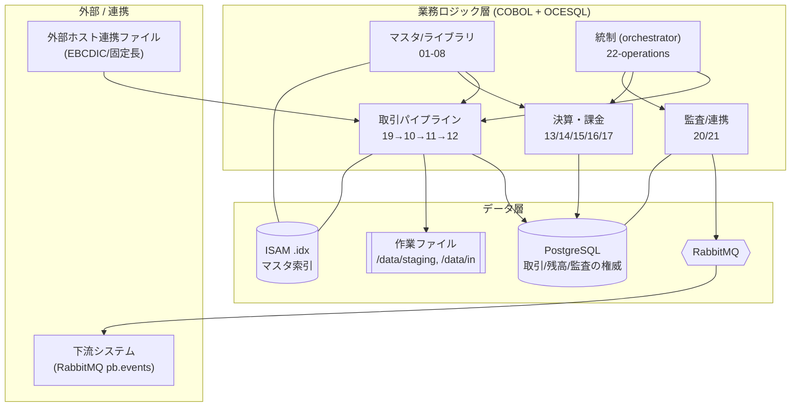
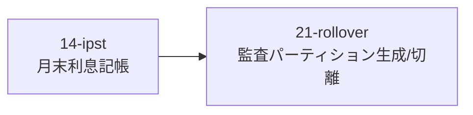
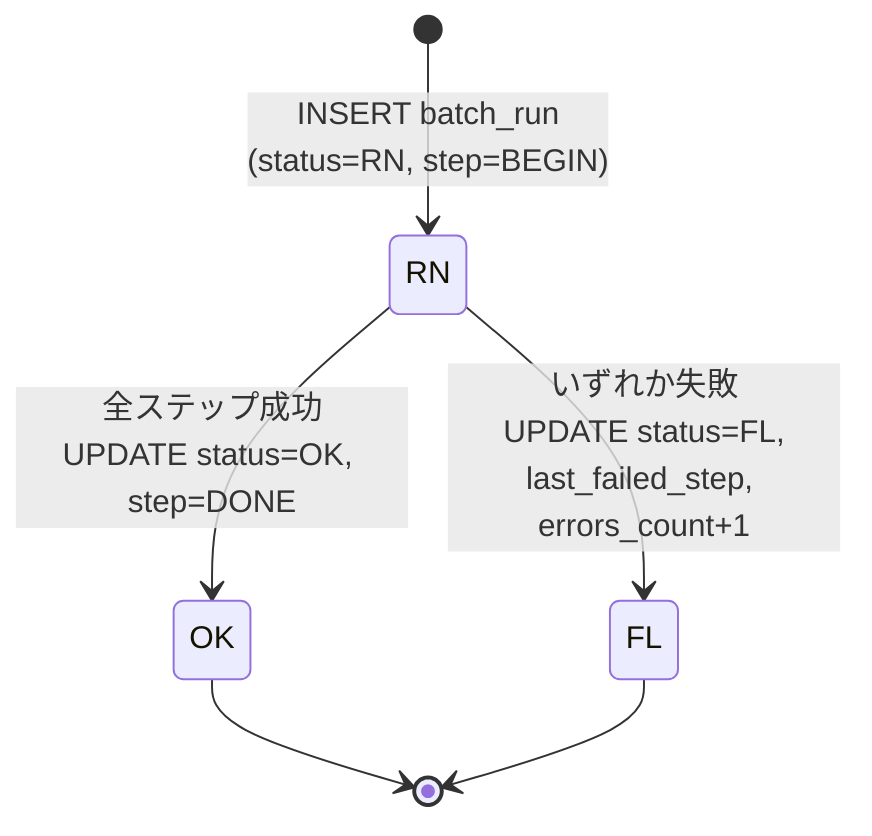
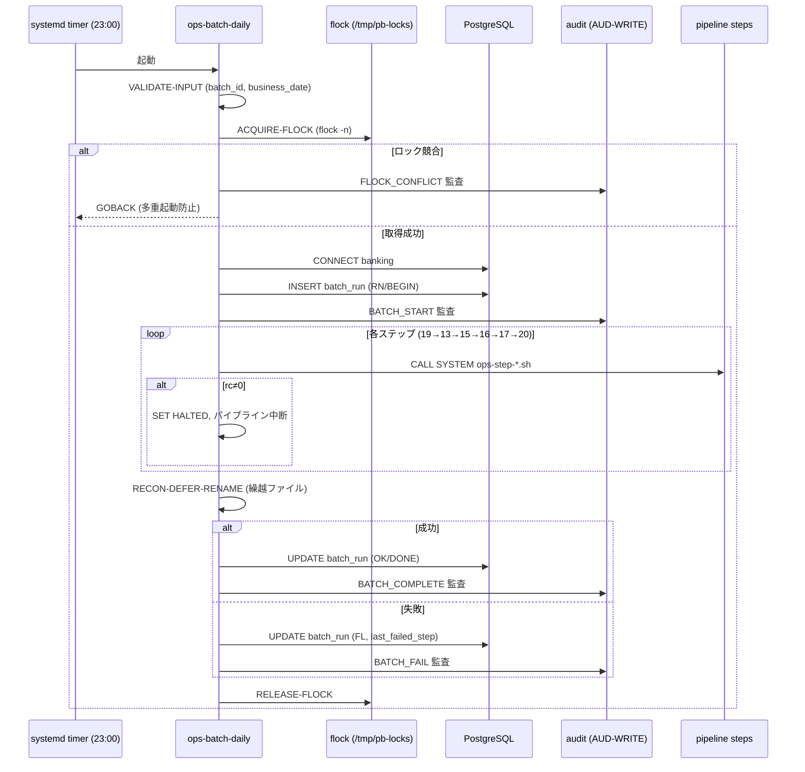
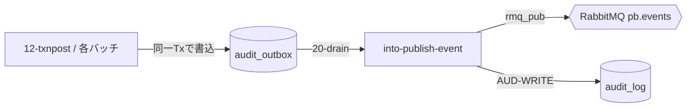

# システム設計書 — Practice Bank（COBOL 銀行業務バッチ）

> 本書は「具体的なシステムの全体像」と「バッチ処理の流れ」をまとめた設計書です。
> 根拠は実コード（`subsystems/*/src`・`db/migration`・`systemd/`・`manifest.yaml`）に基づきます。
> 振る舞いの正は golden master、業務 intent の正は [specs/](../specs/) の Doc 群です。
> 関連: [docs/architecture.md](architecture.md)（移行ループ全体像）／ [specs/subsystems/README.md](../specs/subsystems/README.md)（サブシステム索引）。

---

## 1. システム全体像

Practice Bank は **22 サブシステム**から成る銀行業務バッチシステムです。
ランタイムは **GnuCOBOL + 組込 SQL（OCESQL）**、データストアは **PostgreSQL**、非同期連携は **RabbitMQ**、マスタのローカル索引は **ISAM（固定長 .idx）** です。

### 1.1 レイヤ構成

### 1.2 サブシステム区分

| 区分 | サブシステム | 役割 |
| --- | --- | --- |
| マスタ/ライブラリ | 01-calendar, 02-branch, 03-customer, 05-product, 06-interestrate, 07-feeschedule, 08-account | 参照基盤。初期ロード（init_job）。 |
| オンライン | 04-customersearch, 18-inquiry | 対話照会（container_apps_service）。 |
| 取引パイプライン | 19-integrationin, 10-txnvalidate, 11-txnsortmerge, 12-txnpost | 受信→検証→整列→記帳。 |
| 決算・課金 | 13-interestaccrual, 14-interestpost, 15-autodebit, 16-fee, 17-statement | 利息・自動引落・手数料・明細。 |
| 連携・監査 | 20-integrationout, 21-audit | outbox 公開・監査ログ管理。 |
| 状態管理 | 09-accountlifecycle | 口座ライフサイクル（休眠/再活性）。 |
| 統制 | 22-operations | 日次/月次バッチの統制。 |

詳細は [specs/subsystems/README.md](../specs/subsystems/README.md) を参照。

---

## 2. データモデル

PostgreSQL のテーブル（`db/migration` V1/V2/V7 由来）:

| カテゴリ | テーブル |
| --- | --- |
| マスタ | `accounts`, `customers`, `branches`, `products`, `calendar`, `interest_rates`, `fee_schedules`, `autodebit_schedules` |
| 取引・残高 | `transactions`, `postings`, `balances` |
| 決算 | `interest_accruals` |
| 監査 | `audit_log`（月次 RANGE partition）, `audit_outbox`（transactional outbox） |
| 統制 | `batch_run` |

設計上の制約（根拠: `db/migration`）:

- 金額は `BIGINT`（JPY、最小単位）。利率は `NUMERIC(7,6)`。
- 固定長 `CHAR` キー。JPY 固定の `CHECK` 制約。
- `audit_log` は月次 RANGE partition。`create_audit_partition` / `detach_expired_audit_partitions` 関数で生成・切り離し。

---

## 3. バッチ処理の流れ

### 3.1 スケジュール（根拠: `systemd/*.timer`、タイムゾーン Asia/Tokyo）

| ジョブ | スケジュール | 内容 |
| --- | --- | --- |
| 日次バッチ | 毎日 23:00 | `ops-batch-daily` パイプライン |
| 月次バッチ | 毎月 1 日 02:00 | `ops-batch-monthly`（14-IPST + 21 partition rollover） |
| パーティションロールオーバー | 毎月 25 日 02:00 | 21-audit `ops-partition-rollover`（翌月分の事前生成） |
| 休眠スキャン | 毎週月曜 03:00 | 09-ALC `alc-dormancy-scan` |
| 自動引落リトライ | 毎月 15 日 04:00 | 15-AD retry-only モード |

### 3.2 日次パイプライン（根拠: `ops-batch-daily.sqb` の `RUN-PIPELINE`）

> 注: 19-inti の後段で取引パイプライン（10-txnvalidate → 11-txnsortmerge → 12-txnpost）が
> 取引記帳のコア経路を構成します。日次オーケストレーションが起動する各ステップは
> `ops-step-<id>.sh` を `CALL "SYSTEM"` 経由で実行します（`cobcrun <MODULE>`、OCESQL を `LD_PRELOAD`）。

各ステップの起動契約（根拠: `ops-step-*.sh`）:

- 第1引数 `DRY_RUN`（既定 `Y`）。`Y` のときはスモーク（`.so` 存在確認）のみで `exit 0`。
- `.so` 不在 / `cobcrun` 不在は `exit 1`（= ステップ失敗）。
- 環境変数 `OPS_STEP_INJECT_FAIL` で特定ステップに障害注入（テストフック）。
- 接続情報は `PGHOST/PGUSER/PGPASSWORD/PGDATABASE`（既定 `postgres/cobol/cobol/banking`）。

### 3.3 月次パイプライン（根拠: `ops-batch-monthly.sqb`）

### 3.4 バッチ実行の状態遷移（根拠: `batch_run` への INSERT/UPDATE）

`batch_run` の主なカラム: `batch_id`(PK), `business_date`, `started_ts`, `completed_ts`,
`status`(RN/OK/FL), `current_step`, `last_failed_step`, `errors_count`。
`INSERT ... ON CONFLICT (batch_id) DO UPDATE` で再実行時に冪等にリセットします。

### 3.5 制御フローと安全機構（根拠: `ops-batch-daily.sqb`）

安全機構の要点:

- **多重起動防止**: `flock -n`（非ブロッキング）。競合時は監査を残して即終了。
- **fail-fast**: いずれかのステップで `rc≠0` ならパイプラインを中断（`OPB-HALTED`）。
- **冪等な再実行**: `batch_run` は `ON CONFLICT` で同一 `batch_id` をリセット。
- **繰越（recon-defer）**: 未処理を `recon-defer-<batch>.dat` → `txn-recon-prev.dat` にリネームし翌回へ。
- **dry-run 既定**: ステップは既定 `DRY_RUN=Y`。本実行は明示的に `N` を渡す。

---

## 4. 整合性・監査（transactional outbox）

- 業務更新と監査イベントを**同一トランザクション**で `audit_outbox` に記録（transactional outbox）。
- 20-integrationout が outbox をドレインして RabbitMQ へ **at-least-once** 公開。`INTO_MOCK_BROKER` でテスト時はモック出力に切替。
- 21-audit が `audit_log` を月次パーティションで保持し、フォレンジック照会・集計レポートを提供。

---

## 5. 補助ジョブ

| ジョブ | 起点 | 役割 |
| --- | --- | --- |
| 休眠スキャン | 09-ALC `alc-dormancy-scan` | 休眠閾値超過の口座を休眠化。週次。 |
| 再活性スキャン | 09-ALC `alc-reactivation-scan` | 取引再開口座の状態復帰。 |
| 自動引落リトライ | 15-AD retry-only | 失敗分の再試行（重複排除付き）。月次。 |
| パーティションロールオーバー | 21-audit `ops-partition-rollover` | 翌月パーティション事前生成・期限切れ切離。 |

---

## 6. Azure 移行マッピング（rehost）

| 種別 | サブシステム | Azure ターゲット |
| --- | --- | --- |
| 初期ロード | 01-08（マスタ） | Container Apps `init_job` |
| 対話照会 | 04, 18 | Container Apps Service |
| バッチ | 09-17, 19-22 | Container Apps Jobs |
| データストア | PostgreSQL | Azure DB for PostgreSQL Flexible |
| メッセージング | RabbitMQ | 当面コンテナ、stretch で Service Bus |
| ISAM 索引 | .idx | Azure Files マウント |
| スケジュール | systemd timer | Container Apps Jobs スケジュール |

> rehost 方針: COBOL+OCESQL をコンテナでそのまま動かし、ジョブ/サブシステム単位で ACA Jobs/Service へ写像します（Java 直訳はしない）。

---

## 7. 未確定事項 / リスク

- 取引パイプライン（10/11/12）の起動が日次オーケストレーションのどのステップに正確に接続されるか（19-inti 後段の連鎖）の確証。
- 12-txnpost の SQL retry トランザクション境界・exactly-once 性。
- 13-interestaccrual の数値精度（COMP-3）・経過日数規約の golden 固定。
- 20-integrationout の at-least-once と重複抑止（event_key）戦略。
- systemd timer → ACA Jobs スケジュールへの写像時の TZ/多重起動制御の等価性。
